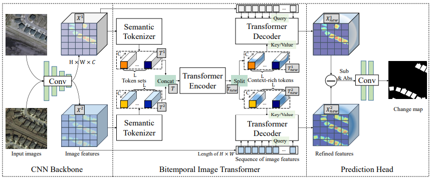
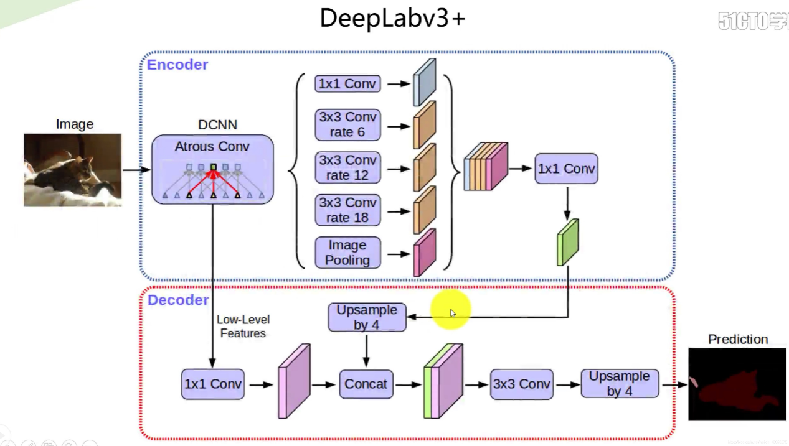
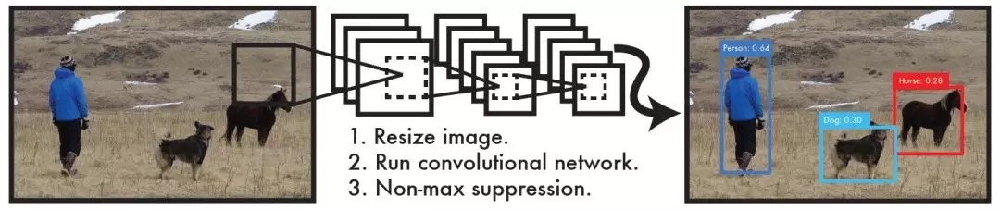
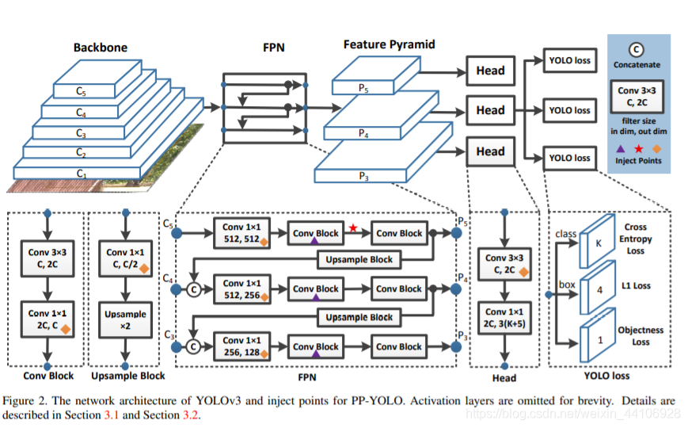
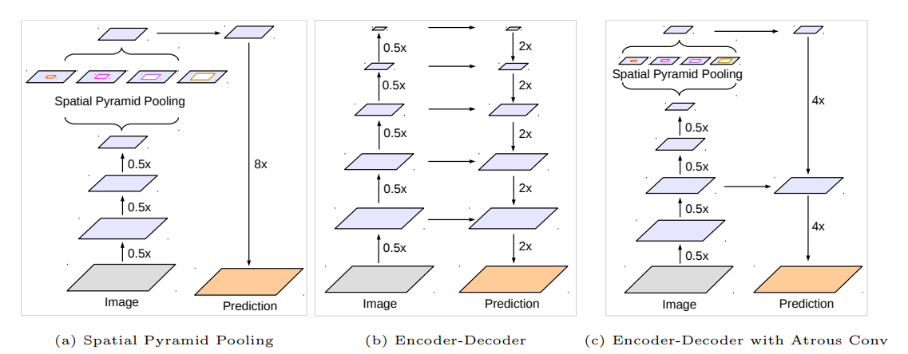

# 深度学习模型介绍
## 变化检测
- 使用模型：BIT 
BIT有三个主要组件：  
*1.Semantic Tokenizer*连体语义标记器，它将像素分组为概念，为两个不同时间输入图像生成一组紧凑的语义标记； 
*2.Transformer Encoder*转换器编码器，它在基于标签的时空中对语义概念的全局信息建模； 
*3.Siamese Transformer Decoder*连体转换器解码器，它将对应的语义标签投射回像素空间，以获得两个不同时间图像的细化特征图。 
    

        
    

BIT模型的工作流程

- 将BIT合并到基于深度特征差分的CD框架中。流程如下：
    - 1.首先，利用CNN主干网（ResNet）用于从输入图像对中提取高级语义特征。
    - 2.利用空间注意将两个不同时间特征图转换为一组紧凑的语义标签。
    - 3.再使用transformer编码器在两个标签集中对全局信息进行建模。
    - 4.生成的含有全局信息丰富的标签由连体transformer解码器重新投影到像素空间，以增强原始像素级特征。
    - 5.最后，从两个细化的特征图中计算特征差异图像（Feature Difference Images，FDI），然后将它们输入到浅层CNN中，以生成像素级的变化预测。 
## 目标提取
- 使用模型：DeepLab V3+ 
DeepLab V3+具有两个主要模块：
    - 1.一个编码器模块，用于逐步减小特征图，同时捕获更高级的语义信息。
    - 2.一个解码器模块，用于逐步恢复空间信息。将DeepLab V3作为编码器模块，在不同尺度应用不同rate的atrous卷积，来编码多尺度的上下文信息；同时在其后加入一个解码器模块，沿着物体边界进行优化，从而获取更锐利的分割结果。
    

        
    

DeepLab V3+模型的工作流程

    首先对编码器特征进行双线性插值上采样，放大倍数为4，然后将其与来自网络主干的具有相同空间分辨率的低级特征连接起来。在低层次特征上应用了另外的1×1卷积以减少通道数量，因为相应的低层次特征通常包含大量通道（例如256或512），这可能超过了丰富编码器功能的重要性（在我们的模型中只有256个通道），使训练变得更加困难。串联后，应用了3×3的卷积来细化特征，然后再进行简单的双线性上采样，其倍数为4。使用编码器模块的输出步幅=16可以在速度和精度之间取得最佳平衡。当将输出步幅=8用于编码器模块时，性能会略有提高，但代价是额外的计算复杂性。
## 目标检测
- 使用模型：PP-YOLO 
PP-YOLO 是飞桨团队在 YOLOv3 的基础上又做了一系列深度优化。通过添加尽量不引入额外计算量的 trick 来提升 YOLOv3 模型的精度，最终在 COCO 数据集上达到了 45.9% 的精度；同时在 V100 单卡上达到了 72.9 FPS；在开启 TensorRT 下，FP16 的推理速度达到 155.6FPS。这使得 PP-YOLO 在精度和速度上达到了最佳平衡，全面超越原生 YOLOv4 模型，成为产业界最佳的目标检测模型。
- 算法特色： 
    - 1.为了兼顾 YOLOv3 模型的精度和预测速度，打造精度速度高性价比的工业实用模型，PP-YOLO 使用了精度速度更优的带可变形卷积的 ResNet50vd 模型（ResNet50vd-DCN），预测速度提升 20%，精度也有小量提升。
    - 2.在此基础上，加入 Coord Conv 和 SPP 等运算量很小，但能有效提升特征提取效率的 trick。
    - 3.另外，还引入了基于 IoU 优化检测框定位精度的 IoU Loss，IoU Aware 等方法。这些方法基本不引入额外的计算，但能有效地提高输出预测框的定位精度，有效解决 YOLOv3 模型定位精度不高的问题。
    - 4.在预测框后处理上，引入 Grid Sensitive 使得预测框学习和解码更加稳定，同时 Matrix NMS 能更加快速有效地完成预测框的非极大值抑制，更高效的保留高质量的预测框，滤除低质量的预测框。
    - 5.在训练过程中，PP-YOLO 模型使用 DropBlock 这种更适用于目标检测的 dropout 方法来减小过拟合，同时使用 EMA（指数滑动平均）的训练方法，即使用梯度历史加权平均值来平滑掉难样本或者误差样本带来的梯度抖动，让训练过程更加平滑稳定。
    - 6.PP-YOLO算法采用一个单独的CNN模型实现end-to-end的目标检测，整个系统如图4.1所示：首先将输入图片resize到448x448，然后送入CNN网络，最后处理网络预测结果得到检测的目标。相比R-CNN算法，其是一个统一的框架，其速度更快，而且PP-YOLO的训练过程也是end-to-end的。
    

        
    

PP-YOLO的处理过程

    

        
    

PP-YOLO模型网络结构

 具体来说，PP-YOLO的CNN网络将输入的图片分割成S*S网格，每个单元格负责检测中心点落在该格子内的目标，如图4.2所示，可以看到狗这个目标的中心落在左下角一个单元格内，那么该单元格负责预测该目标。每个单元格会预测B个边界框（bounding box）以及边界框的置信度（confidence score）。置信度包含两个方面，一是这个边界框含有目标的可能性大小，二是这个边界框的准确度。前者记为Pr(object)，当该边界框是背景时（即不包含目标），Pr(object)=0。而当该边界框包含目标时，Pr(object)=1。边界框的准确度可以用预测框与实际框（ground truth）的IOU（intersection over union，交并比）来表征，记为IOU。因此置信度可以定义为Pr(object)*IOU。Yolo的置信度并不是边界框是否含有目标的概率，而是两个因子（Pr(object)和IOU）的乘积，预测框的准确度也反映在其中。边界框的大小与位置可以用4个值来表征：(x,y,h,w)，其中(x,y)是边界框的中心坐标，(h,w)是边界框的宽与高。此外，中心坐标的预测值(x,y)是相对于每个单元格左上角坐标点的偏移值，并且单位是相对于单元格大小的，单元格的坐标定义如图4所示。而边界框的w和h预测值是相对于整个图片的宽与高的比例，理论上4个元素的大小应该在[0,1]范围。因此，每个边界框的预测值实际上包含5个元素：(x,y,w,h,c)，其中前4个表征边界框的大小与位置，而最后一个值是置信度。
 ## 地物分类
- 使用模型：DeepLab V3+ 
为了在多个尺度上捕获上下文信息，DeepLab v3以不同的膨胀系数应用了几个并行的空洞卷积（ASPP），而PSPNet在不同的网格尺度上执行池化操作。即使在最后的特征图中对丰富的语义信息进行了编码，由于与网络主干内的跨步操作进行池化或卷积，因此缺少与目标边界有关的详细信息。这可以通过应用空洞卷积提取更密集的特征图来缓解。以ResNet-101为例，当应用空洞卷积提取比输入分辨率小16倍的输出特征时，必须扩展最后3个残差块（9层）中的特征。更糟糕的是，如果需要比输入小8倍的输出特征，则会影响26个残差块，因此，如果为此类模型提取更密集的输出特征，则将占用大量计算资源。另一方面，编码器-解码器模型有助于在编码器路径中进行更快的计算（因为不会扩展任何特征），并逐渐在解码器路径中恢复清晰的目标边界。为了结合两种方法的优点，通过合并多尺度上下文信息来丰富编码器-解码器网络中的编码器模块。
    

        
    

DeepLab V3+构成

 模型DeepLab v3+，通过添加一个简单而有效的解码器模块来恢复对象边界，从而扩展了DeepLab v3，如上图所示。丰富的语义信息在DeepLab v3的输出中进行了编码，通过空洞卷积可以实现根据计算资源来控制编码器功能的密度。此外，解码器模块允许详细的目标边界恢复。
Spatial pyramid pooling：比如DeepLab、PSPNet，通过利用多尺度信息，这些模型已在多个基准上显示出令人鼓舞的结果。
Encoder-decoder：通常，编码器-解码器网络包含（1）逐渐减少特征图并捕获更高语义信息的编码器模块，以及（2）逐渐恢复空间信息的解码器模块。
Depthwise separable convolution：深度可分离卷积或分组卷积，一种强大的操作，可以降低计算成本和参数数量，同时保持类似（或稍好一点）的性能。 此操作已在许多最近的神经网络设计中采用。特别是，我们探索了Xception模型，并显示了语义分割任务的准确性和速度方面的改进。
