# 功能区
本平台主功能区为用户提供遥感图像智能解译服务，主要功能为
- 变化检测
- 目标检测
- 目标提取
- 地物分类
## 主要功能效果展示
- 1.变化检测
  

    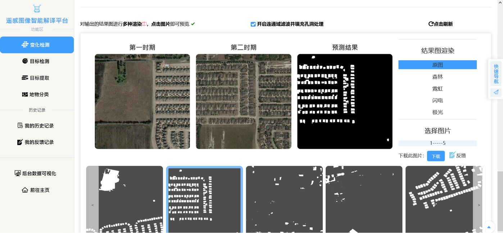
  

- 2.目标检测
  

    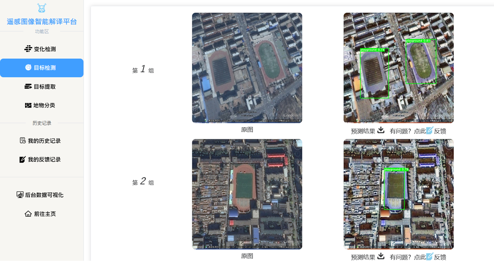
  

- 3.目标提取
  

    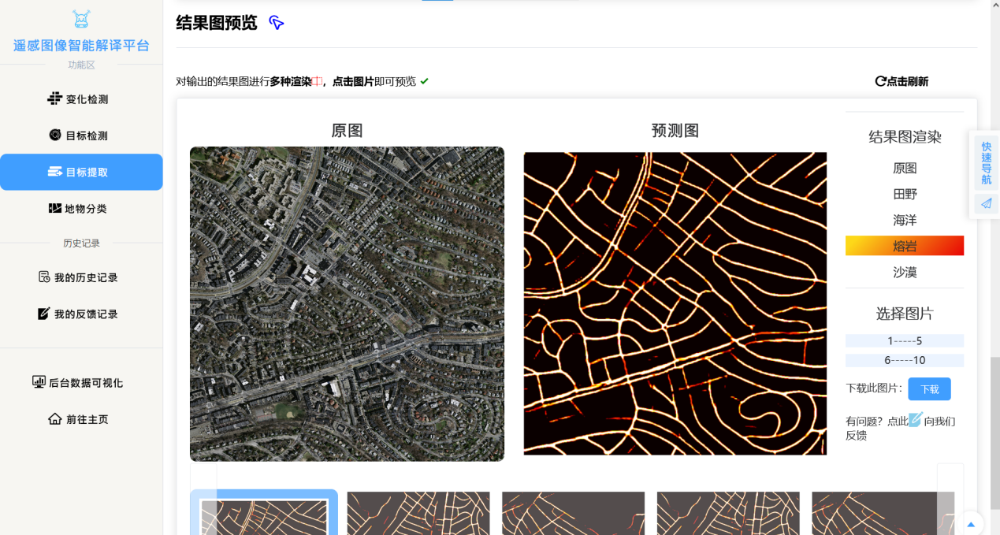
  

- 4.地物分类
 

    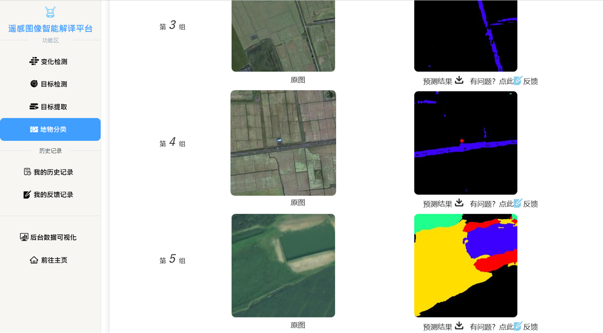
  

  
## 扩展功能效果展示
- 1.图片裁剪
  

    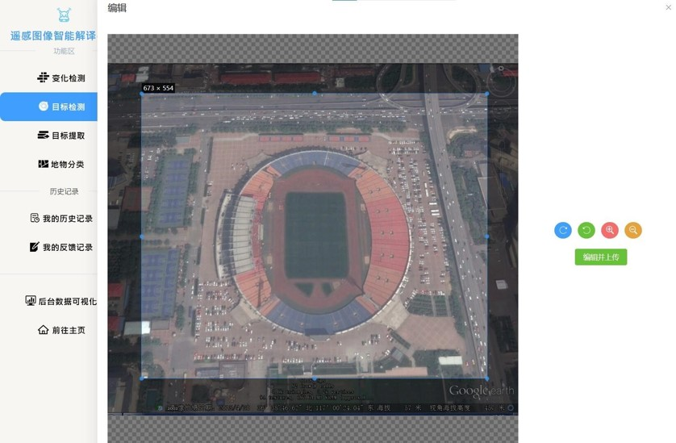
  

- 2.直方图匹配
  

    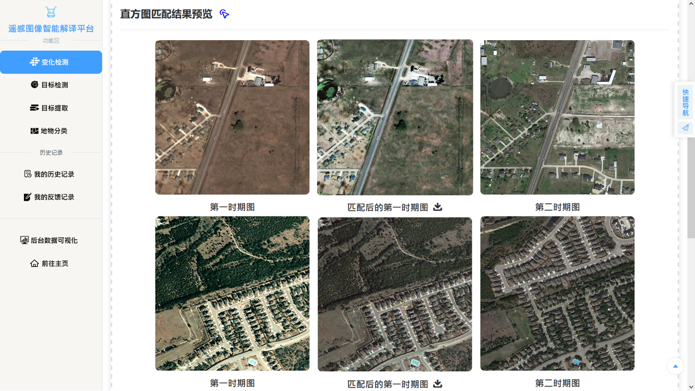
  

- 3.CLAHE（限制对比度直方图均衡化）
  

    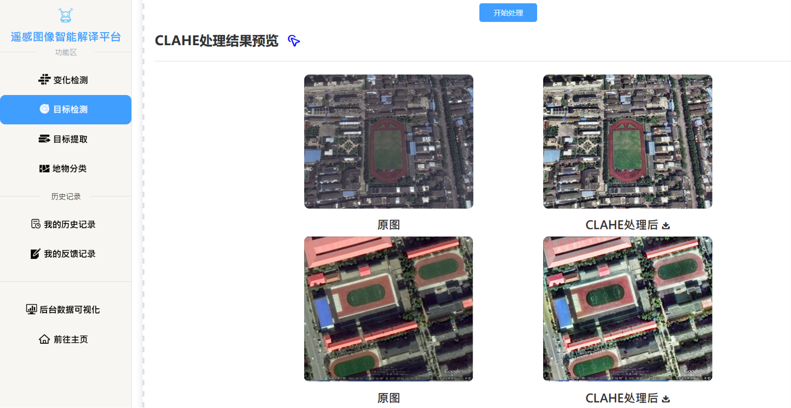
  

- 4.渲染（变化检测/目标提取）
  

    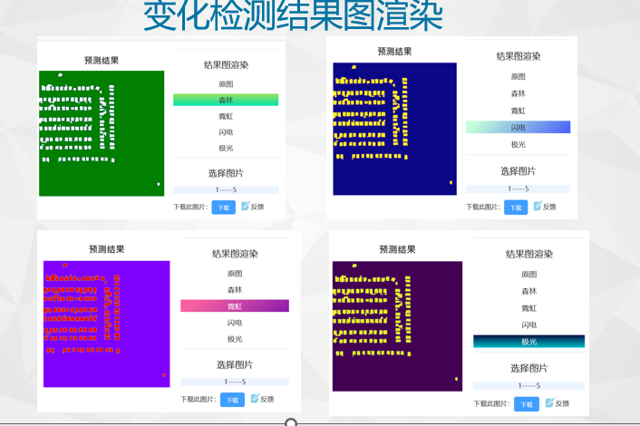
  

  

    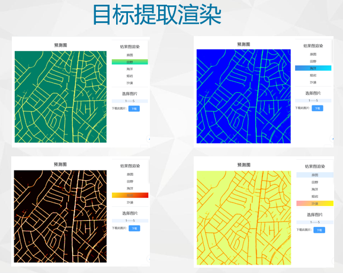
  

- 5.连通域滤波及孔洞填充
  

    
  

- 6.问题反馈
  

    
  

- 7.数据可视化
  

    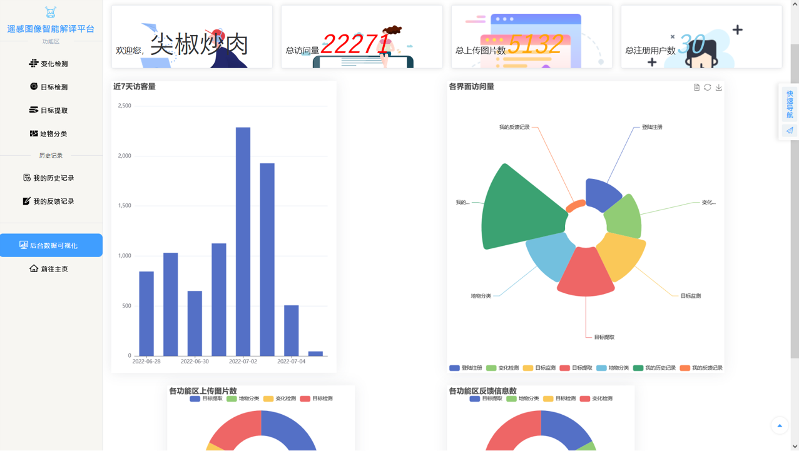
  

- 8.查看我的历史记录
  

    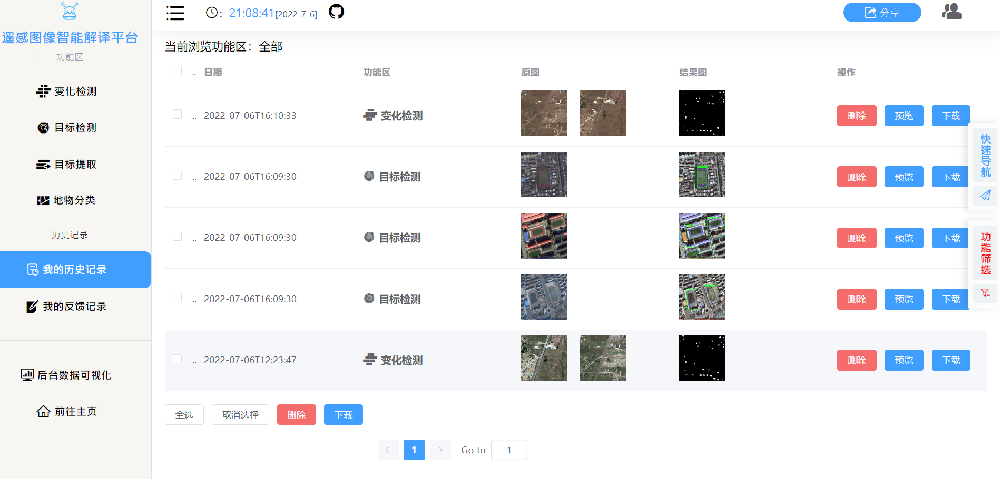
  
 
 ## 管理员界面
 - 1.用户信息管理
  

    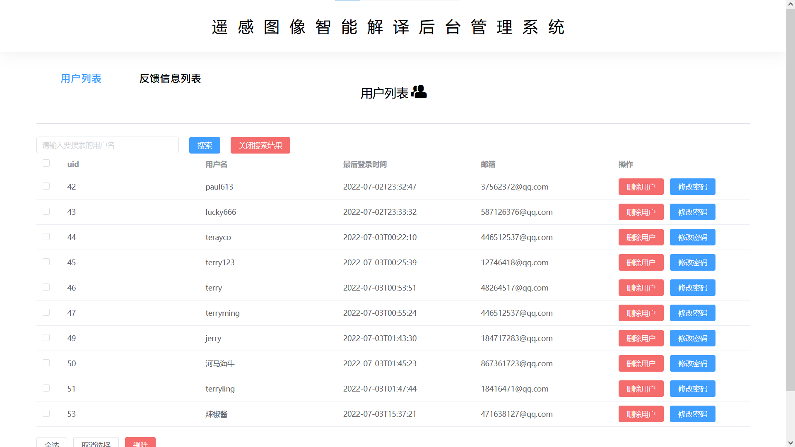
  
 
 - 2.反馈信息查看
  

    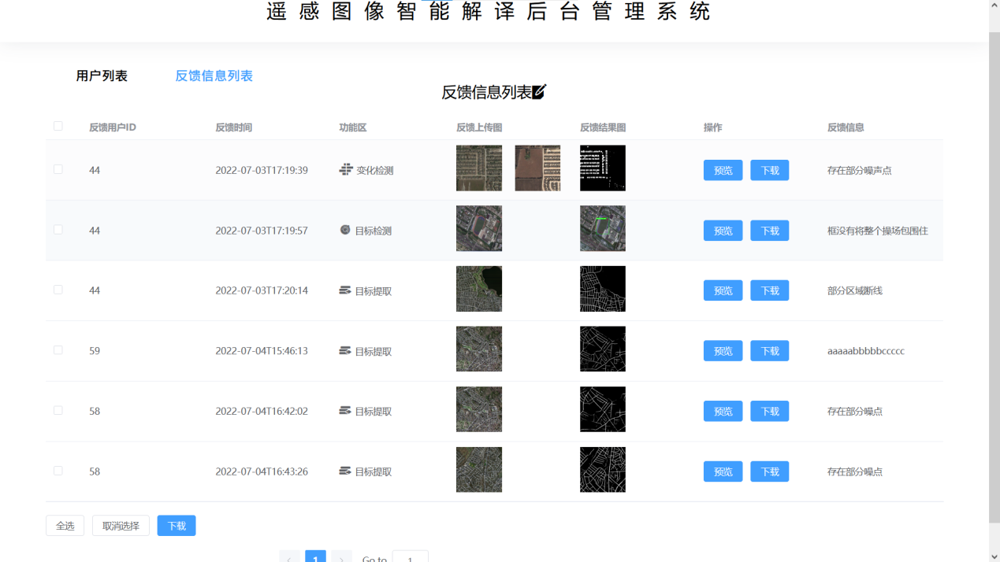
  
 

