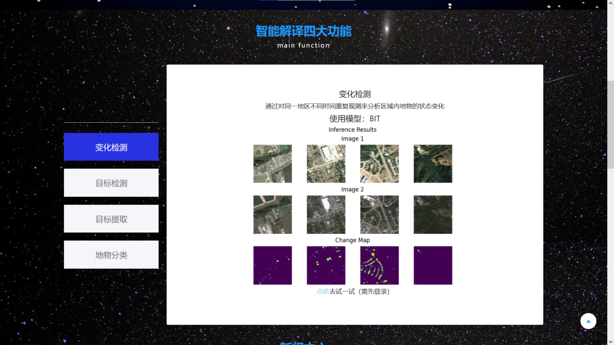
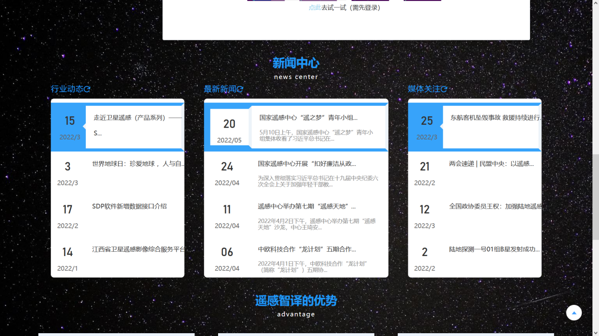
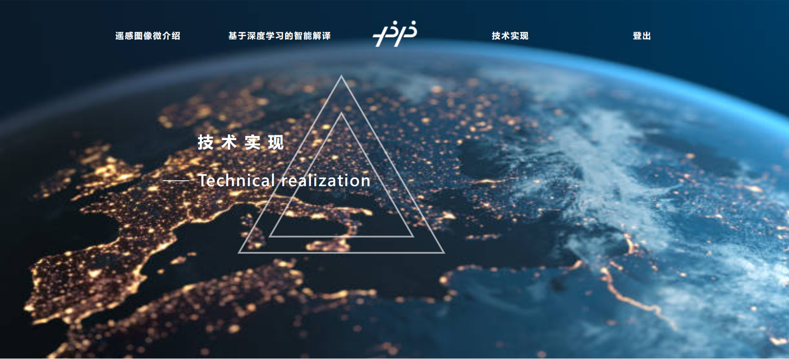
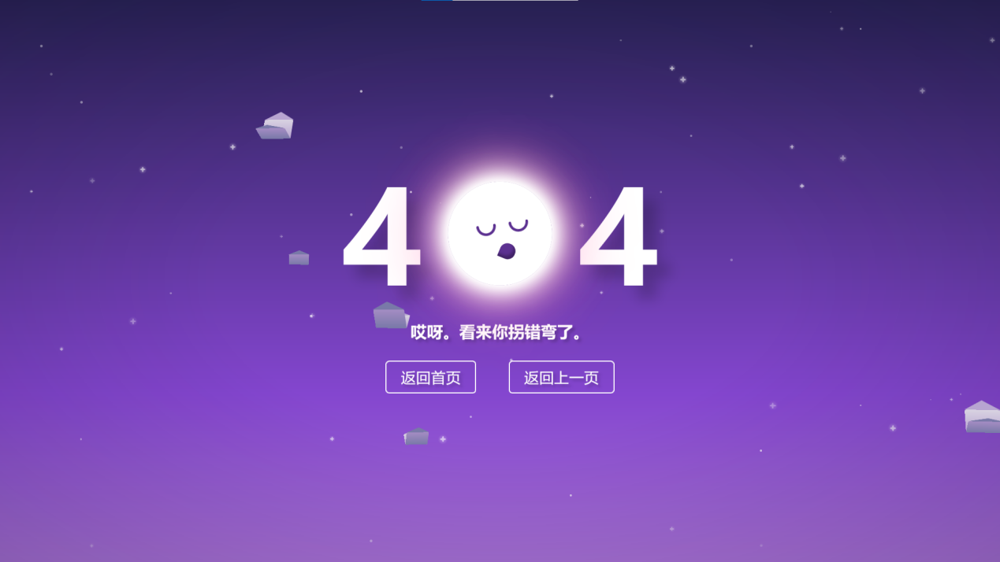

# 平台主页
本平台主页分为以下四个部分
- 遥感图像微介绍（让用户了解什么是遥感）
- 基本功能介绍及新闻中心（简要介绍各功能，新闻中心提供用户遥感相关讯息）
- 技术实现介绍（介绍平台所用到的开发的技术）
- 登录注册界面（用户需登录后才能使用所有功能）
## 平台主页展示
- 第一部分———遥感图像微介绍
  

    
  

- 第二部分———基本功能介绍及新闻中心
  

    
  

  

    功能介绍部分
  

    

    
  

  

    新闻中心
  

- 第三部分———技术实现介绍页
  

    
  

- 第四部分———登录注册界面
  

    
  

  小彩蛋————考虑到有些同学不小心走错方向，我们还特意设置了一个可爱的404画面：
   

    
  

