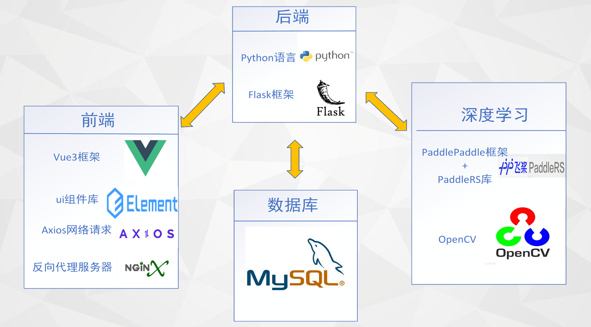

# 系统架构
本系统架构如下图所示

## 各部分开发工具
- 前端
  - [vue3](https://v3.vuejs.org/)框架
  - [ElementUI](https://element-plus.org/zh-CN/#/zh-CN)组件库
  - [Axios](https://axios-http.com/zh/)网络请求
  - [Nginx](http://nginx.org/)反向代理服务器
- 后端
  - 基于[python](https://www.python.org/)语言开发
  - [flask](https://flask.palletsprojects.com/en/2.1.x/)框架
  - 数据库:[MySQL](https://www.mysql.com/)
- 深度学习算法
  - [PaddleRS](https://github.com/PaddleCV-SIG/PaddleRS)
  - [OpenCV](https://opencv.org/)
